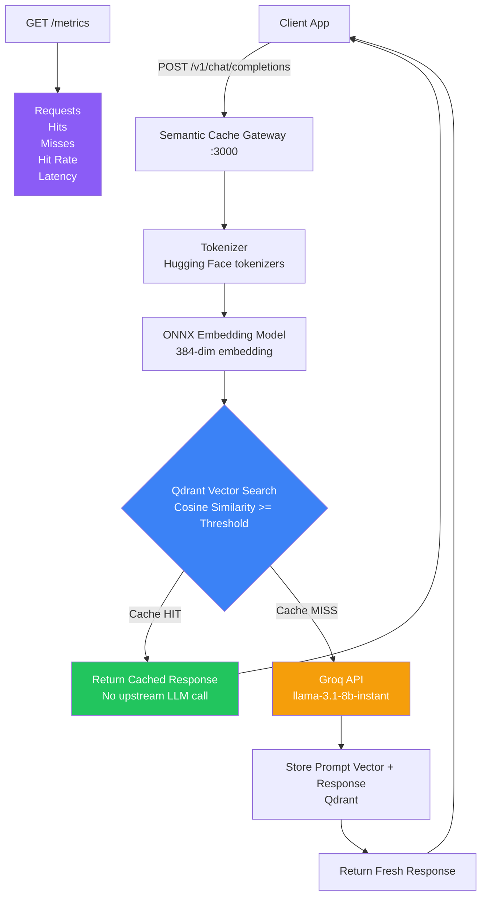
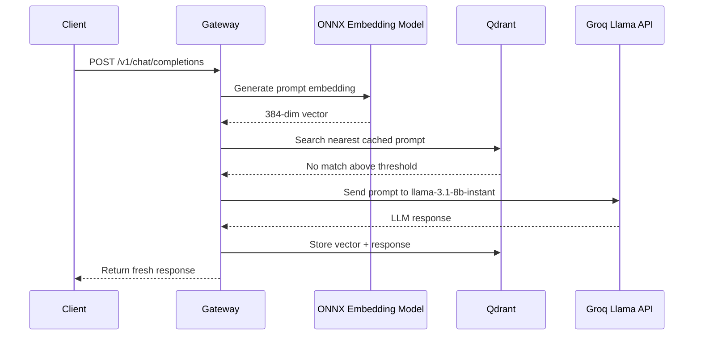
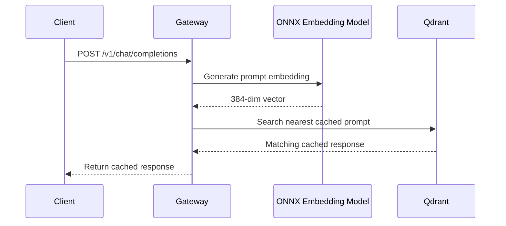

# Semantic Cache Gateway

> OpenAI-compatible semantic cache for LLM APIs.  
> Avoid repeated upstream LLM calls for exact and semantically similar prompts by serving cached responses from a local vector store.

<p align="center">
  
</p>

## Problem

LLM applications often receive prompts that are different in wording but equivalent in meaning:

```text
What is the capital of France?
Which city is the capital of France?
Tell me France's capital.
```

Without semantic caching, every one of those requests is forwarded to the upstream LLM provider. That adds repeated latency and repeated API cost for answers that may already exist.

## Solution

Semantic Cache Gateway runs between your application and the upstream LLM API.

For each request, it:

1. extracts the latest user message,
2. generates a local embedding with an ONNX model,
3. searches Qdrant for a semantically similar cached prompt,
4. returns the cached response on a cache hit,
5. calls the upstream LLM only on a cache miss,
6. stores the new prompt vector and response for future reuse.

## Features

- OpenAI-compatible `POST /v1/chat/completions` endpoint.
- Required model field for explicit model-aware requests.
- Local embedding generation with ONNX Runtime.
- Hugging Face tokenizer support.
- Qdrant-backed cosine similarity search.
- Configurable cache-hit threshold.
- Cache metrics endpoint.
- Docker Compose setup for gateway + Qdrant.

## Architecture



## Request Flow

### Cache Miss



### Cache Hit



## API

### Chat Completions

```text
POST /v1/chat/completions
```

Example:

```bash
curl -X POST http://127.0.0.1:3000/v1/chat/completions \
  -H "Content-Type: application/json" \
  -d '{
    "model": "llama-3.1-8b-instant",
    "messages": [
      {
        "role": "user",
        "content": "What is the capital of France?"
      }
    ]
  }' | python3 -m json.tool
```

Supported model:

```text
llama-3.1-8b-instant
```

### Metrics

```text
GET /metrics
```

Example:

```bash
curl http://127.0.0.1:3000/metrics | python3 -m json.tool
```

## Benchmark

Run:

```bash
./benchmark.sh
```

The benchmark sends:

1. a first request that should miss the cache,
2. the same request again, which should hit the cache,
3. a paraphrased request, which should hit if similarity is above the configured threshold,
4. a metrics request.

| Scenario | Expected Result | Upstream LLM Call |
|---|---:|---:|
| First query | Cache miss | Yes |
| Same query again | Cache hit | No |
| Paraphrased query | Semantic cache hit | No, if similarity threshold is met |

## Tech Stack

| Layer | Technology |
|---|---|
| Gateway | Rust, Axum |
| Async runtime | Tokio |
| Embeddings | ONNX Runtime via `ort` |
| Tokenizer | Hugging Face `tokenizers` |
| Vector database | Qdrant |
| Similarity metric | Cosine similarity |
| Upstream LLM | Groq OpenAI-compatible API |
| Model | `llama-3.1-8b-instant` |
| Containerization | Docker, Docker Compose |

## Configuration

| Variable | Required | Default | Description |
|---|---:|---:|---|
| `API_KEY` | Yes | none | Groq API key |
| `QDRANT_URL` | No | `http://127.0.0.1:6334` | Qdrant gRPC endpoint |
| `APP_HOST` | No | `127.0.0.1` | Gateway bind host |
| `APP_PORT` | No | `3000` | Gateway bind port |
| `CACHE_SCORE_THRESHOLD` | No | `0.90` | Minimum cosine similarity for cache hit |

## Docker Compose

Create `.env`:

```bash
API_KEY=your_groq_api_key
CACHE_SCORE_THRESHOLD=0.90
```

Start:

```bash
docker compose up --build
```

Run the benchmark from another terminal:

```bash
./benchmark.sh
```

## Local Development

Start Qdrant:

```bash
docker run -p 6333:6333 -p 6334:6334 \
  -v "$(pwd)/qdrant_storage:/qdrant/storage" \
  qdrant/qdrant
```

Run the gateway:

```bash
export API_KEY="your_groq_api_key"
export QDRANT_URL="http://127.0.0.1:6334"
export CACHE_SCORE_THRESHOLD="0.90"

cargo run --release
```

## Model Files

The gateway expects the embedding model and tokenizer here:

```text
model/
├── model.onnx
└── tokenizer.json
```

The embedding output dimension is expected to be `384`.

## Project Structure

```text
semantic-cache-gateway/
├── Cargo.toml
├── Dockerfile
├── docker-compose.yml
├── benchmark.sh
├── src/
│   └── main.rs
├── model/
│   ├── model.onnx
│   └── tokenizer.json
└── assets/
    └── demo.gif
```

## Limitations

This is a proof-of-concept gateway. A production version should add:

- authentication,
- TLS,
- rate limiting,
- request validation limits,
- structured logging,
- cache invalidation,
- tenant isolation,
- streaming response support,
- observability,
- horizontal scaling.
